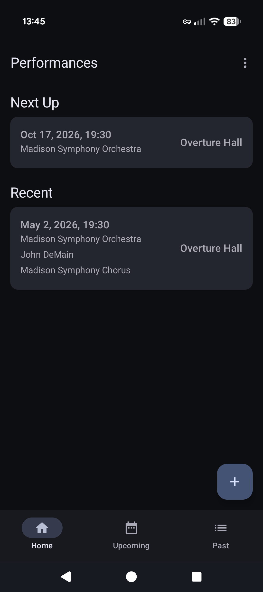
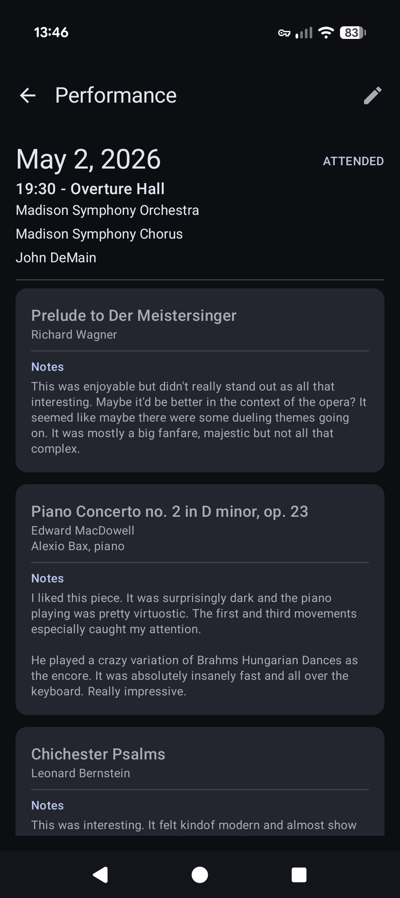
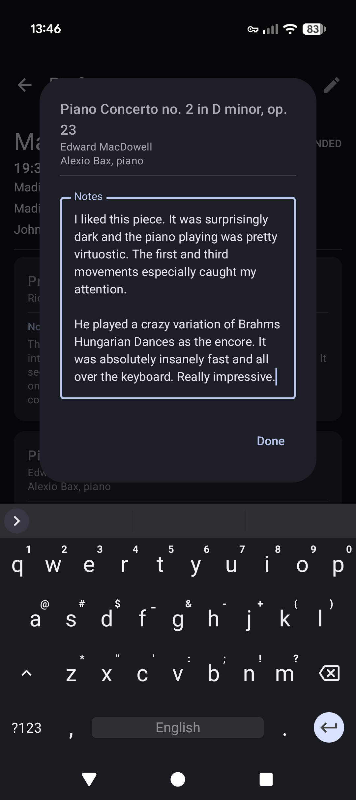
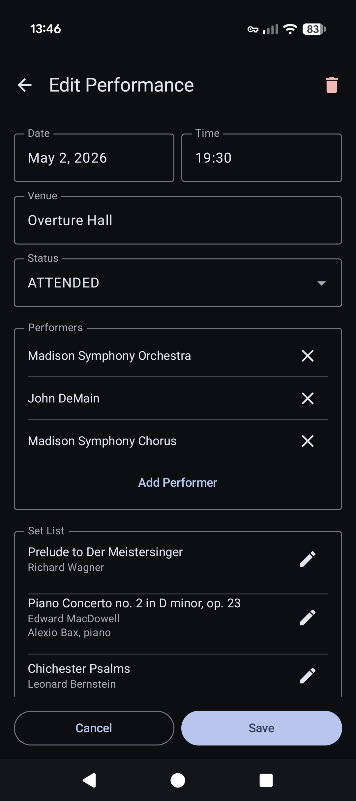
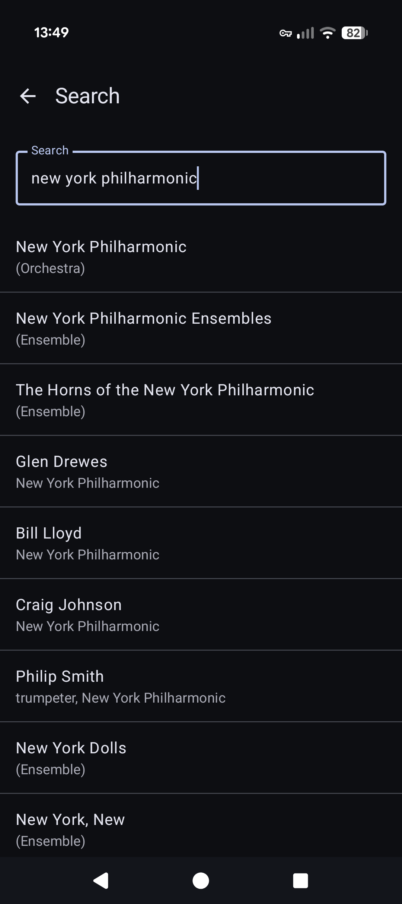
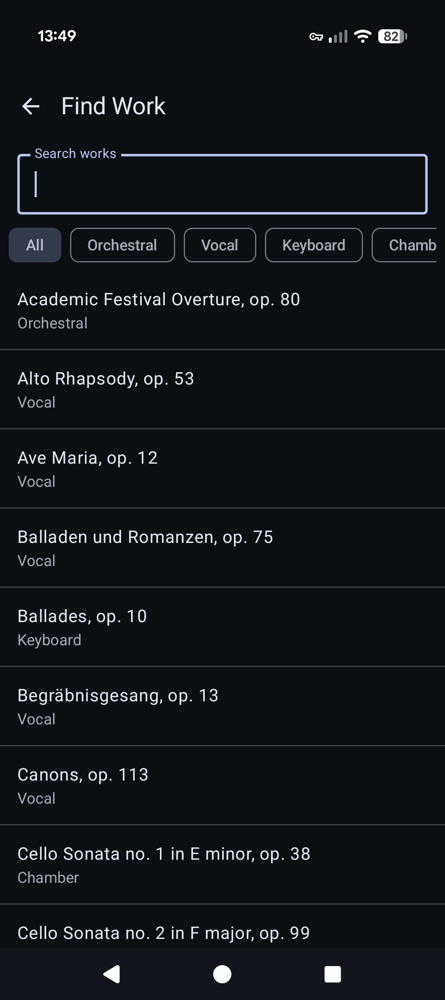
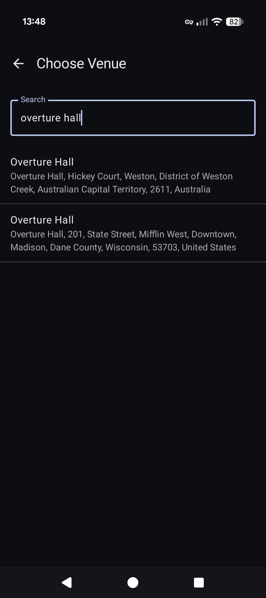

# What does this app do?
This is an Android app for keeping track of classical music concerts you've attended or plan to attend.
It lets you record all of the details that matter for a classical performance - the pieces on the program, who composed them, the performers and conductor, and the venue.
 
During the performance, you can take listening notes on each piece and refer back to your notes later.

# Features
## Performances at a glance
The home screen surfaces what's relevant right now: a **Next Up** card for your soonest upcoming concert and a **Recent** list of concerts you've been to in the last 30 days. **Upcoming** and **Past** tabs let you browse everything else.

## Performance details
Data that can be recorded about each performance includes date, time, venue, and performers, along with the full **set list** of pieces that were played. Opening a performance shows the program in order, with each pieces's composer, any featured soloists, and your own notes about each piece.

## Notes
You can attach your own notes to any work on a set list, capturing what stood out about a particular performance of a piece.

## Building a performance
Adding or editing a performance walks you through filling out every part of the program. You set the date and time, pick a venue, add the headline performers, and assemble the set list one work at a time.

## Searching real data sources
Rather than typing everything by hand, the app looks up performers, composers, works, and venues against established databases, so names and details stay consistent. Searching for a performer queries **MusicBrainz** and shows what each result is - orchestra, ensemble, soloist, chorus, or conductor - before you add it to your own library.

 

Composers and pieces are looked up against **Open Opus**, complete with their opus numbers and category, and you can filter by type (Orchestral, Vocal, Keyboard, Chamber, etc.) to find the right piece quickly. If something isn't in the database, you can create a custom entry inline without leaving the search.

 

Venues are searched against **OpenStreetMap** via Nominatim, so a concert hall or opera house is identified by its real address and location.

# Technical Details
This app was built using [Kotlin](https://kotlinlang.org/) and [Jetpack Compose](https://developer.android.com/compose).
It is the Android client for a [self-hosted backend API (FastAPI + PostgreSQL)](https://github.com/chaddy50/FastAPIConcertTrackerAPI) that stores your library.

## Libraries Used
[Retrofit 2](https://github.com/square/retrofit) for making type-safe HTTP API calls.
 
[kotlinx.serialization](https://github.com/Kotlin/kotlinx.serialization) for parsing JSON responses.
 
[Hilt](https://developer.android.com/training/dependency-injection/hilt-android) for dependency injection.
 
[Jetpack DataStore](https://developer.android.com/topic/libraries/architecture/datastore) for storing app settings (such as the API server URL) locally.
 
[Navigation Compose](https://developer.android.com/jetpack/compose/navigation) for navigating between screens.

## External APIs
[MusicBrainz](https://musicbrainz.org/doc/MusicBrainz_API) for looking up performers.
 
[Open Opus](https://openopus.org/) for looking up classical composers and their works.
 
[OpenStreetMap Nominatim](https://nominatim.org/) for looking up concert venues.
